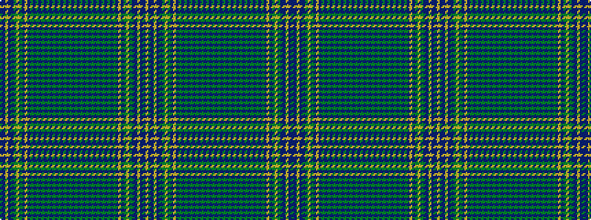

BBYBBGYGBYBGBGBGBGBGBGBGBGBGBGBGBGBGBGBGBGBYBGYGBBYBBY

It is a 54 stripe tartan.

<figure class="pat-woven">

<figcaption>idealised sample</figcaption>
</figure>

## Colour Sequence



## Tartans with this colour sequence

This pattern is a design lineage: every tartan below shares one colour order, whatever its owner —
near-identical designs are grouped, the largest lineage first (#112: the pattern is a tartan's
second parent, beside its family or clan).

<table class="sett-table">
<tbody>
<tr><td><a href="/variants/s54/dr17db1lr10db1dr4g10lr1g11dr11lr2db10g10dr2g1dr11g1dr2g11dr10g1dr42g1dr2g1dr2g1dr42g1dr2g1dr2g1dr2g1dr10g11dr2g1dr11g1dr2g10db10lr2dr11g11lr1g10dr4db1lr10db1dr17lr2~x2/">MacDonald of Staffa #6</a></td></tr>
<tr><td class="sett-swatch"></td></tr>
</tbody>
</table>

