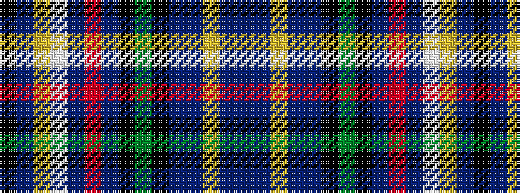

BBYBBKGKBRBWYBK

It is a 15 stripe tartan.

<figure class="pat-woven">

<figcaption>idealised sample</figcaption>
</figure>

## Colour Sequence



## Tartans with this colour sequence

| Tartans |
|---------------|
| [Causeway, The](/setts/s15/n38t8lg3n20t42k2g6k2t2m3t2w2lg10t2k6/)|
||
