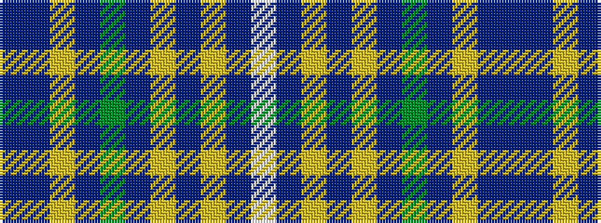

BBYBGBYBYBW

It is a 11 stripe tartan.

<figure class="pat-woven">

<figcaption>idealised sample</figcaption>
</figure>

## Colour Sequence



## Tartans with this colour sequence

| Tartans |
|---------------|
| [Toyokawa Check](/variants/s11/n36dr10lo2dr5g2dr5lo10n5lo2n10w2~x2/)|
||
