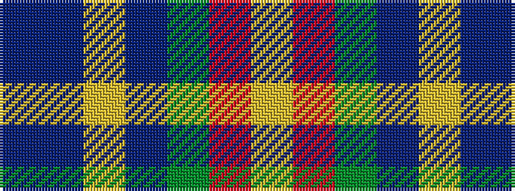

BBYBGRY

It is a 7 stripe tartan.

<figure class="pat-woven">

<figcaption>idealised sample</figcaption>
</figure>

## Colour Sequence



## Tartans with this colour sequence

| Tartans |
|---------------|
| [Lachance (Canada) (Personal)](/setts/s7/n50t50ly1b27g18o9ly4~x2/)|
||
| [Lachance Commemorative Tartan Tartan Number: 10645. Earliest known date: 01/04/2012 This tartan is designed to commemorate the award of the Queens Diamond Jubilee Medal in 2012. The colours inspired by the Lachance Arms are: silver (‘argent’), nobility, peace and serenity; green (‘vert’), antiquity and strength; gold (‘or’), the light of the sun; blue (‘azure’), the eastern sky; brown (‘brun’) for the base of the trees. See products available Copyright © Blair Urquhart, Comrie, 2015](/setts/s7/n50t50ly1db27g18o9ly4~x2/)|
||
