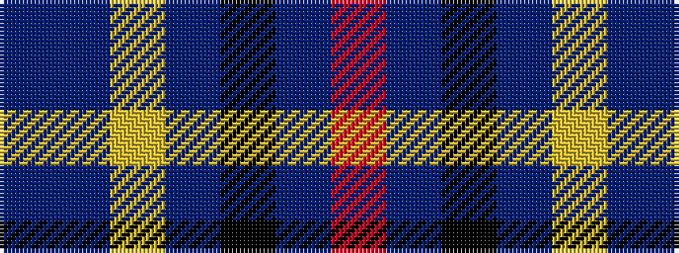

BBYBKBR

It is a 7 stripe tartan.

<figure class="pat-woven">

<figcaption>idealised sample</figcaption>
</figure>

## Colour Sequence



## Tartans with this colour sequence

| Tartans |
|---------------|
| [Edinburgh & Lothian T.B. (Corporate)](/variants/s7/dbi40db8lo3db6k3db6r4~x2/)|
||
| [Milne-Murtaugh (Personal)](/variants/s7/r5t2k30n26ly2n2db4~x2/)|
||
