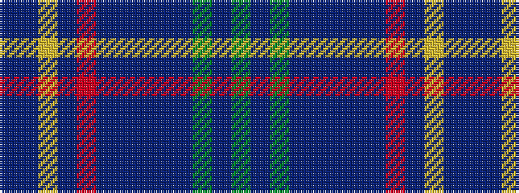

BBYBRBBBBBGBG

It is a 13 stripe tartan.

<figure class="pat-woven">

<figcaption>idealised sample</figcaption>
</figure>

## Colour Sequence



## Tartans with this colour sequence

| Tartans |
|---------------|
| [Dempster (Personal)](/setts/s13/g9b6g18b34db6b10db6b34r6b8ly6db34b4/)|
||
