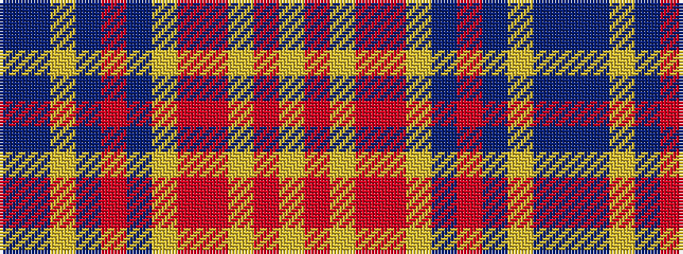

BBYBRBYRRYRY

It is a 12 stripe tartan.

<figure class="pat-woven">

<figcaption>idealised sample</figcaption>
</figure>

## Colour Sequence



## Tartans with this colour sequence

| Tartans |
|---------------|
| [Rainbow #2](/setts/s12/bi21b21lg21bi2r2b2ly21ri21r21lg2ri2ly2~x2/)|
||
