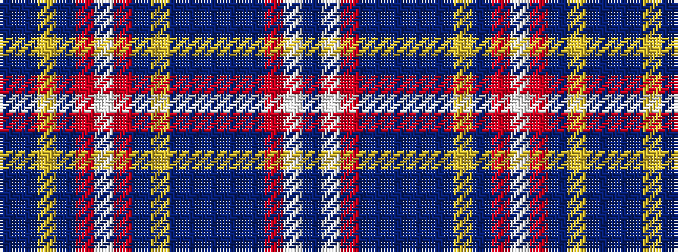

BBYBRWRBYBBBBBRWB

It is a 17 stripe tartan.

<figure class="pat-woven">

<figcaption>idealised sample</figcaption>
</figure>

## Colour Sequence



## Tartans with this colour sequence

| Tartans |
|---------------|
| [Wcwm 1572-1](/setts/s17/db4lb6r2do6b2db4b2do6lo1do2r2lb2r2do2lo1do6b2~x4/)|
||
