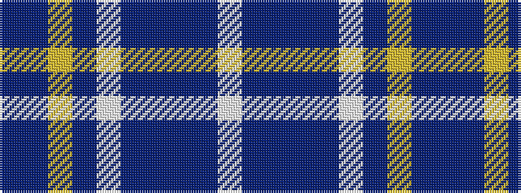

BBYBWBBBBW

It is a 10 stripe tartan.

<figure class="pat-woven">

<figcaption>idealised sample</figcaption>
</figure>

## Colour Sequence



## Tartans with this colour sequence

| Tartans |
|---------------|
| [Diamond Jubilee (Lochcarron) (Comm.)](/setts/s10/dp46db12lo3db3lb3dp11db5db2db7w2~x2/)|
||
