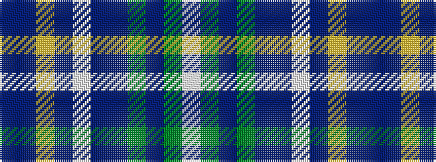

BBYBWBBGBGW

It is a 11 stripe tartan.

<figure class="pat-woven">

<figcaption>idealised sample</figcaption>
</figure>

## Colour Sequence



## Tartans with this colour sequence

| Tartans |
|---------------|
| [Brighton & Hove](/setts/s11/db16ti8lo1ti1w1ti1t6g3ti1g3w1~x4/)|
||
