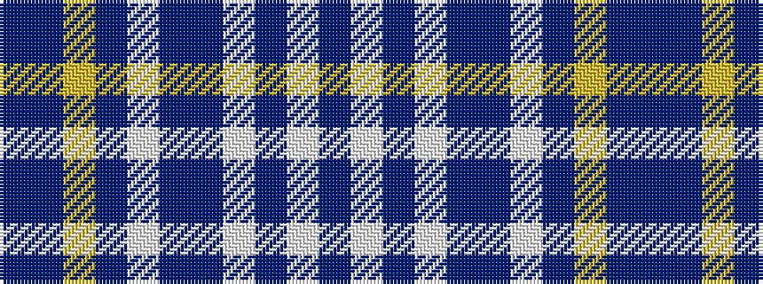

BBYBWBBWBWB

It is a 11 stripe tartan.

<figure class="pat-woven">

<figcaption>idealised sample</figcaption>
</figure>

## Colour Sequence



## Tartans with this colour sequence

| Tartans |
|---------------|
| [Goil Dress](/variants/s11/t42db10lo2db2lb2db2t10lb6db2lb3t2~x2/)|
||
