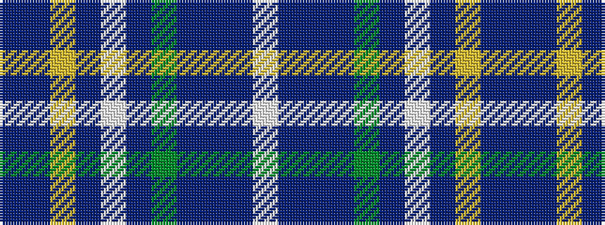

BBYBWBGBBBW

It is a 11 stripe tartan.

<figure class="pat-woven">

<figcaption>idealised sample</figcaption>
</figure>

## Colour Sequence



## Tartans with this colour sequence

| Tartans |
|---------------|
| [Holyrood Corporate Tartan](/variants/s11/db54dbi14ly3dbi3w3dbi3g9dr7dbi2dr9w2~x2/)|
||
