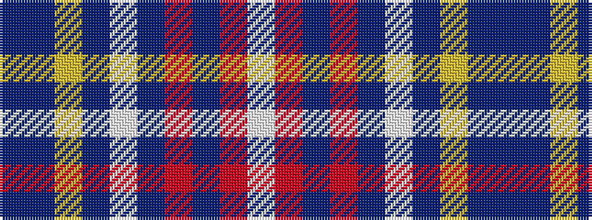

BBYBWBRBRW

It is a 10 stripe tartan.

<figure class="pat-woven">

<figcaption>idealised sample</figcaption>
</figure>

## Colour Sequence



## Tartans with this colour sequence

| Tartans |
|---------------|
| [Unidentified #47](/variants/s10/db10t5lo2t2lb2t5o4t2o4lb2~x4/)|
||
