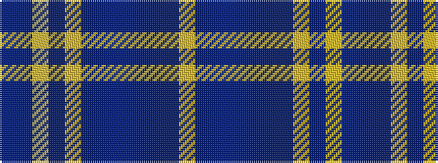

BBYBYBBBBBBY

It is a 12 stripe tartan.

<figure class="pat-woven">

<figcaption>idealised sample</figcaption>
</figure>

## Colour Sequence



## Tartans with this colour sequence

| Tartans |
|---------------|
| [Glover, Thomas Blake (Corporate)](/setts/s12/db4dr16lo6dr16lo6dr16db8dr6db4dr16db2lo1~x2/)|
||
