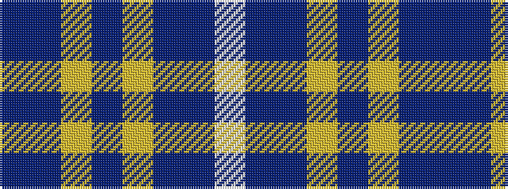

BBYBYBBW

It is a 8 stripe tartan.

<figure class="pat-woven">

<figcaption>idealised sample</figcaption>
</figure>

## Colour Sequence



## Tartans with this colour sequence

| Tartans |
|---------------|
| [Hoosier (Fashion)](/setts/s8/b15db65ly7b4ly3db30b15w3~x2/)|
||
