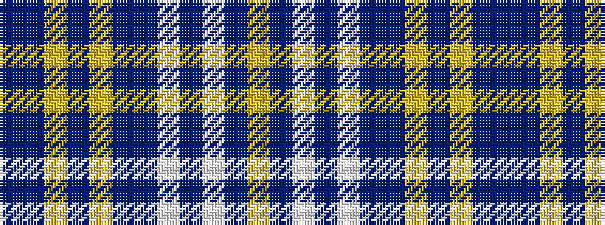

BBYBYBBWBWBY

It is a 12 stripe tartan.

<figure class="pat-woven">

<figcaption>idealised sample</figcaption>
</figure>

## Colour Sequence



## Tartans with this colour sequence

| Tartans |
|---------------|
| [Glover, Thomas Blake](/setts/s12/db5dr10lo4dr10lo4dr10db5lb4db3lb10db1lo1~x2/)|
||
