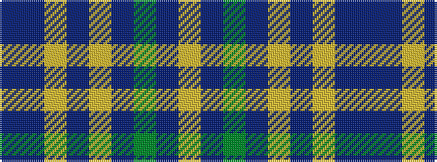

BBYBYBGBY

It is a 9 stripe tartan.

<figure class="pat-woven">

<figcaption>idealised sample</figcaption>
</figure>

## Colour Sequence



## Tartans with this colour sequence

| Tartans |
|---------------|
| [Wicklow County Crest (Fashion)](/variants/s9/db16dbi7lo4dbi2lo16dbi2y24dbi8lr11~x2/)|
||
