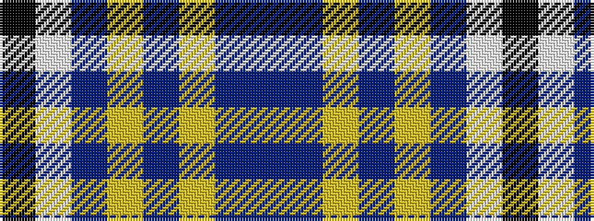

BBYBYBWK

It is a 8 stripe tartan.

<figure class="pat-woven">

<figcaption>idealised sample</figcaption>
</figure>

## Colour Sequence



## Tartans with this colour sequence

| Tartans |
|---------------|
| [Edinburgh Festival](/setts/s8/b46dp3lr3dp3lr4dp12w3k3~x2/)|
||
