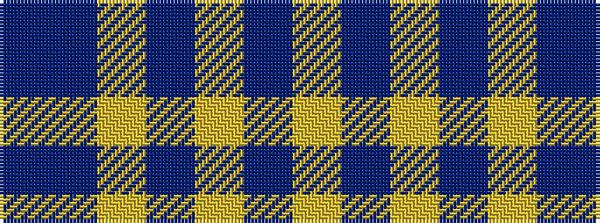

BBYBYBY

It is a 7 stripe tartan.

<figure class="pat-woven">

<figcaption>idealised sample</figcaption>
</figure>

## Colour Sequence



## Tartans with this colour sequence

| Tartans |
|---------------|
| [Creek Indian Nation (District)](/variants/s7/db2db4ly1db1ly2db4ly2~x12/)|
||
