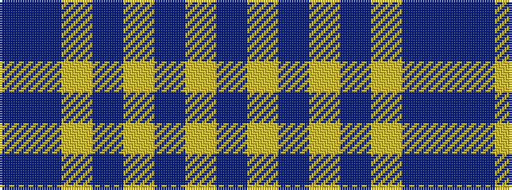

BBYBYBYB

It is a 8 stripe tartan.

<figure class="pat-woven">

<figcaption>idealised sample</figcaption>
</figure>

## Colour Sequence



## Tartans with this colour sequence

| Tartans |
|---------------|
| [Morris (Welsh Name)](/setts/s8/db6db3ly3db2ly3db4ly48db4/)|
||
