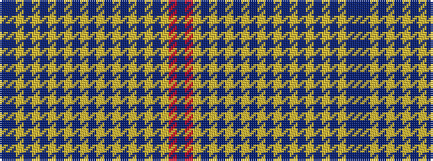

BBYBYBYBYBYBYBYBYBYBYRB

It is a 23 stripe tartan.

<figure class="pat-woven">

<figcaption>idealised sample</figcaption>
</figure>

## Colour Sequence



## Tartans with this colour sequence

| Tartans |
|---------------|
| [Unidentified Plaid 3](/variants/s23/n126r3ly16n20ly4n4ly4n4ly4n4ly4n4ly4n4ly4n4ly4n4ly4n4ly4dr130n10/)|
||
