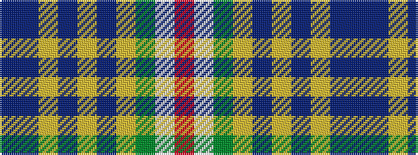

BBYBYBYGWR

It is a 10 stripe tartan.

<figure class="pat-woven">

<figcaption>idealised sample</figcaption>
</figure>

## Colour Sequence



## Tartans with this colour sequence

| Tartans |
|---------------|
| [Yukon](/setts/s10/r4w4g4ly4db4ly1db2ly1db20p4~x2/)|
||
| [Yukon](/setts/s10/r4w4g4ly4db5ly1db1ly1db16p4~x2/)|
||
| [Yukon #1906 District Tartan Tartan Number: 1906. Earliest known date: 1984 Nothing See products available Copyright © Blair Urquhart, Comrie, 2015](/setts/s10/dp4db16ly1db1ly1db5ly4g4w4r4~x2/)|
||
| [Yukon (asymmetric)](/setts/s10/dp4db20ly1db2ly1db4ly4dg4w4r4~x2/)|
||
| [Yukon District Tartan Tartan Number: 1907. Earliest known date: 1984 Lord Lyon records a symetrical version. See products available Copyright © Blair Urquhart, Comrie, 2015](/setts/s10/dp4db20ly1db2ly1db4ly4g4w4r4~x2/)|
||
