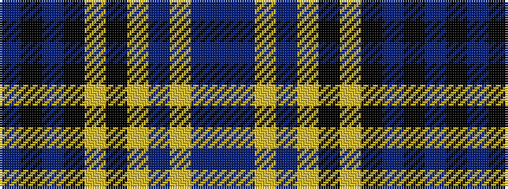

BBYBYKYKBKB

It is a 11 stripe tartan.

<figure class="pat-woven">

<figcaption>idealised sample</figcaption>
</figure>

## Colour Sequence



## Tartans with this colour sequence

| Tartans |
|---------------|
| [Dutton, Stuart (Personal)](/setts/s11/db4k4db10k10ly2k10lr4db8lr12db2dp1~x2/)|
||
