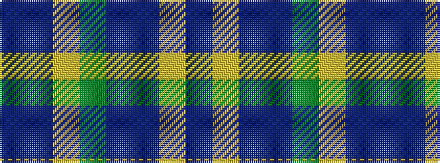

BBYGBBYB

It is a 8 stripe tartan.

<figure class="pat-woven">

<figcaption>idealised sample</figcaption>
</figure>

## Colour Sequence



## Tartans with this colour sequence

| Tartans |
|---------------|
| [Los Angeles (District)](/variants/s8/t4t24ly5g2t3db5ly33db2~x2/)|
||
