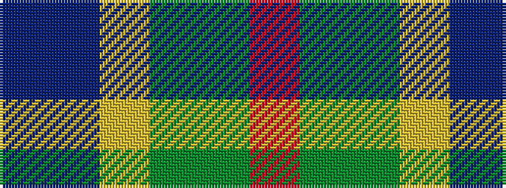

BBYGGR

It is a 6 stripe tartan.

<figure class="pat-woven">

<figcaption>idealised sample</figcaption>
</figure>

## Colour Sequence



## Tartans with this colour sequence

| Tartans |
|---------------|
| [Loch Fyne](/variants/s6/r1dy3g5lo5dt5t1~x4/)|
||
