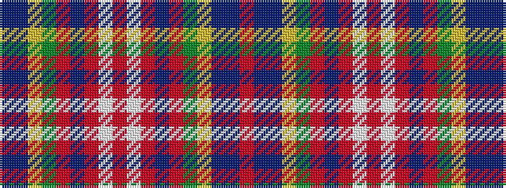

BBYGRBRWRWRBRGYBBR

It is a 18 stripe tartan.

<figure class="pat-woven">

<figcaption>idealised sample</figcaption>
</figure>

## Colour Sequence



## Tartans with this colour sequence

| Tartans |
|---------------|
| [Norwich No.057](/variants/s18/r4t4db8ly1g12r6db2r6w1r6w1r6db2r6g12ly1db8t4~x4/)|
||
