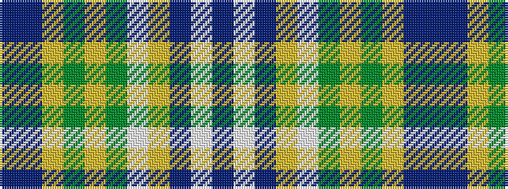

BBYGYGWYBWB

It is a 11 stripe tartan.

<figure class="pat-woven">

<figcaption>idealised sample</figcaption>
</figure>

## Colour Sequence



## Tartans with this colour sequence

| Tartans |
|---------------|
| [Chalk, Robert (Personal)](/variants/s11/dp2w5dp5ly11w5dg12lr1dg2lr26do2dp2~x2/)|
||
