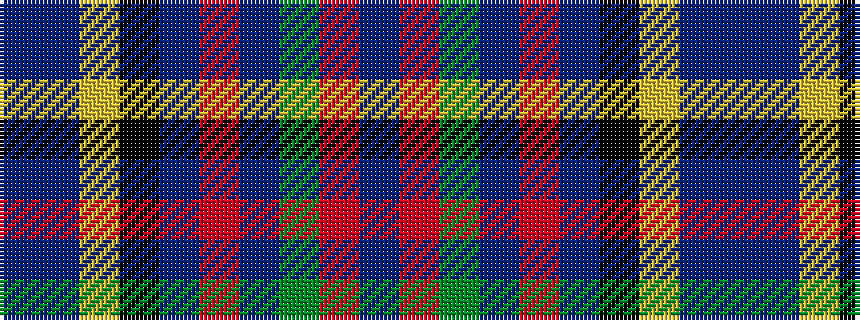

BBYKBRBGRB

It is a 10 stripe tartan.

<figure class="pat-woven">

<figcaption>idealised sample</figcaption>
</figure>

## Colour Sequence



## Tartans with this colour sequence

| Tartans |
|---------------|
| [Thousand Islands](/setts/s10/db20t8lo5k6t4r3t3y30r2t3~x2/)|
||
