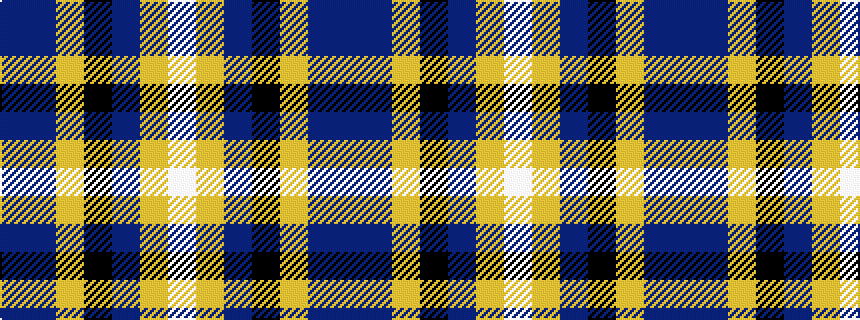

BBYKBYW

It is a 7 stripe tartan.

<figure class="pat-woven">

<figcaption>idealised sample</figcaption>
</figure>

## Colour Sequence



## Tartans with this colour sequence

| Tartans |
|---------------|
| [Ritchie, Stephen James (Personal)](/variants/s7/t4n19lr2k19n2lr25lb2~x2/)|
||
