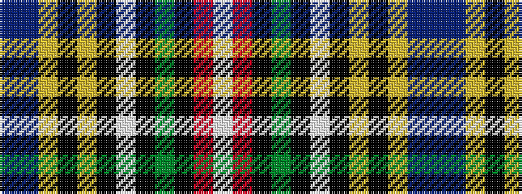

BBYKYKWKGKRW

It is a 12 stripe tartan.

<figure class="pat-woven">

<figcaption>idealised sample</figcaption>
</figure>

## Colour Sequence



## Tartans with this colour sequence

| Tartans |
|---------------|
| [Bethune](/setts/s12/b2db18ly4k5ly1k1w1k2g8k1r3w1~x4/)|
||
