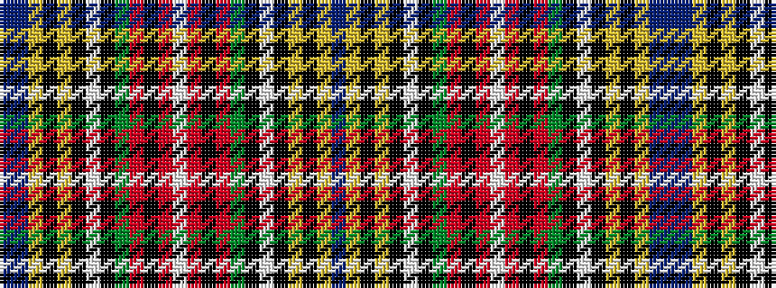

BBYKYKWKGRKRWRKRGKWKYKYB

It is a 24 stripe tartan.

<figure class="pat-woven">

<figcaption>idealised sample</figcaption>
</figure>

## Colour Sequence



## Tartans with this colour sequence

| Tartans |
|---------------|
| [Bethune Name Tartan Tartan Number: 2428. Earliest known date: pre 1997 Designed by Phil Smith - same as Macbeth but with the addition of a light blue stripe in the middle of the darker blue ground. Count said to be from William MacIntosh & Co. See products available Copyright © Blair Urquhart, Comrie, 2015](/setts/s24/db18ly4k5ly1k1w1k2g8r6k1r3w1r3k1r6g8k2w1k1ly1k5ly4db18t2~x4/)|
||
