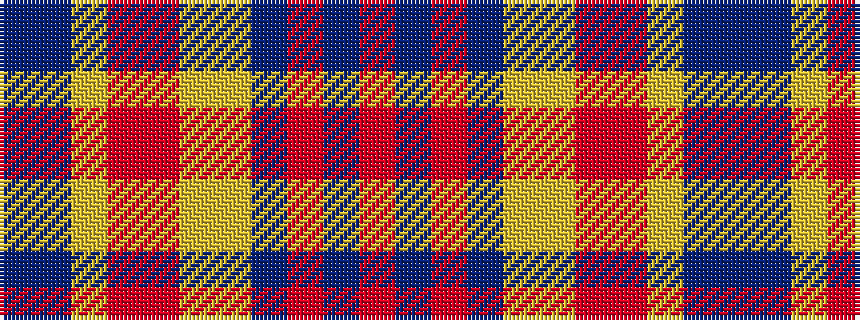

BBYRRYYBRBR

It is a 11 stripe tartan.

<figure class="pat-woven">

<figcaption>idealised sample</figcaption>
</figure>

## Colour Sequence



## Tartans with this colour sequence

| Tartans |
|---------------|
| [Watret (Artefact)](/setts/s11/db21dp21ly21o2r21lo21ly21db2r2dp2o21~x2/)|
||
