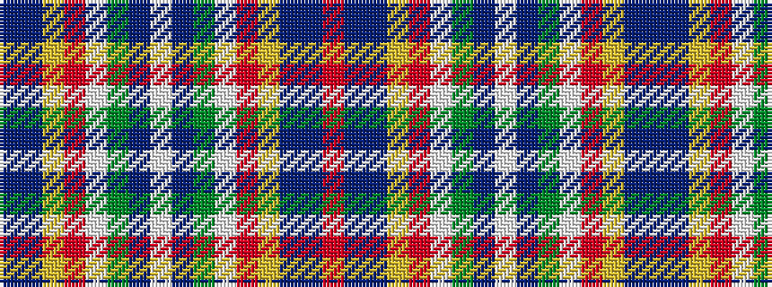

BBYRWGBWBGWRYBBR

It is a 16 stripe tartan.

<figure class="pat-woven">

<figcaption>idealised sample</figcaption>
</figure>

## Colour Sequence



## Tartans with this colour sequence

| Tartans |
|---------------|
| [Wilson's No.227](/variants/s16/r26t7dp8ly3r3w3g20dp10w2~x2/)|
||
