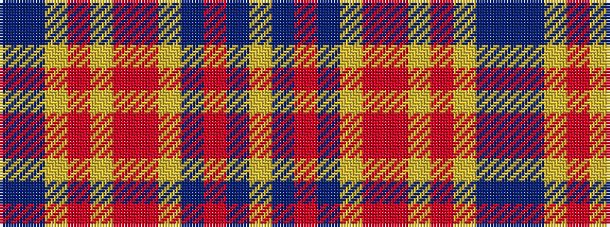

BBYRYRRYBRBY

It is a 12 stripe tartan.

<figure class="pat-woven">

<figcaption>idealised sample</figcaption>
</figure>

## Colour Sequence



## Tartans with this colour sequence

| Tartans |
|---------------|
| [Watret](/setts/s12/db21dp21ly2r2lg2r21r21ly21db2r2dp2lg21~x2/)|
||
