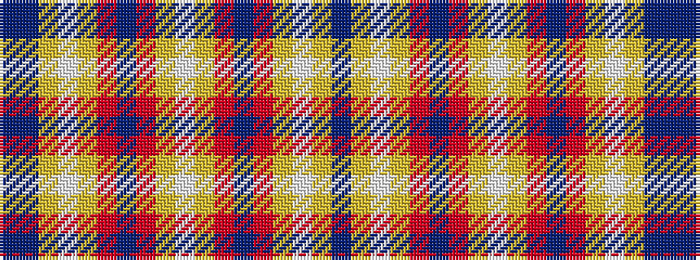

BBYWYRBRYWYRBRYWYB

It is a 18 stripe tartan.

<figure class="pat-woven">

<figcaption>idealised sample</figcaption>
</figure>

## Colour Sequence



## Tartans with this colour sequence

| Tartans |
|---------------|
| [Holyrood Golden Jubilee II](/variants/s18/dt48t12lo3w3lo3r11dt5r2lo7w2~x2/)|
||
