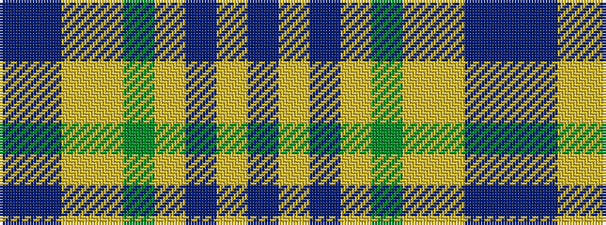

BBYYGYBYB

It is a 9 stripe tartan.

<figure class="pat-woven">

<figcaption>idealised sample</figcaption>
</figure>

## Colour Sequence



## Tartans with this colour sequence

| Tartans |
|---------------|
| [Brighton Mac Dermotte](/variants/s9/dt47ly1do27lr4dg5ly1lr8t1do1~x2/)|
||
