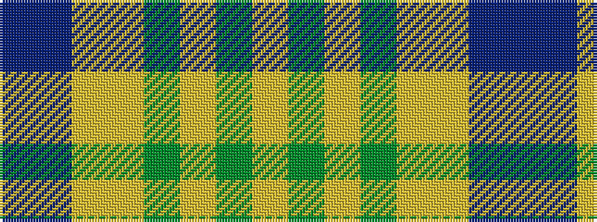

BBYYGYGY

It is a 8 stripe tartan.

<figure class="pat-woven">

<figcaption>idealised sample</figcaption>
</figure>

## Colour Sequence



## Tartans with this colour sequence

| Tartans |
|---------------|
| [McClurg (Name)](/variants/s8/t4db32ly3ly32g1ly2g1ly4~x2/)|
||
