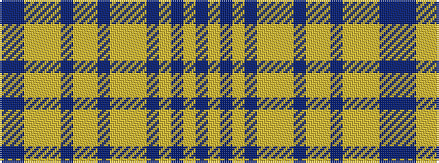

BBYYYBYYBYYYBYBYB

It is a 17 stripe tartan.

<figure class="pat-woven">

<figcaption>idealised sample</figcaption>
</figure>

## Colour Sequence



## Tartans with this colour sequence

| Tartans |
|---------------|
| [Agincourt (Fashion)](/setts/s17/dt4lo1dt3lo1dt1lo1lo1lo6dt4lo2lo6dt7lo6lo1lo28dt1dt1~x4/)|
||
