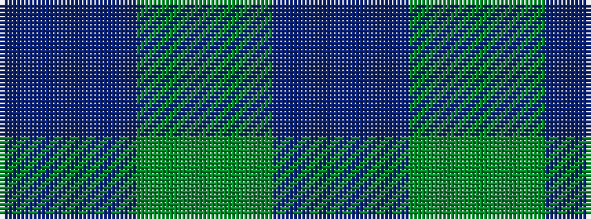

BGB

It is a 3 stripe tartan.

<figure class="pat-woven">

<figcaption>idealised sample</figcaption>
</figure>

## Colour Sequence



## Tartans with this colour sequence

| Tartans |
|---------------|
| [Wilson's, No 209](/setts/s3/p5g4t2~x2/)|
||
