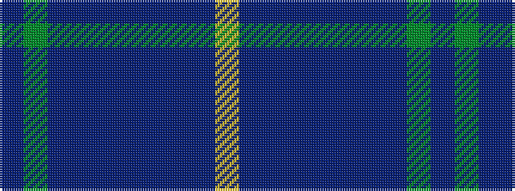

BGBBBBBBBY

It is a 10 stripe tartan.

<figure class="pat-woven">

<figcaption>idealised sample</figcaption>
</figure>

## Colour Sequence



## Tartans with this colour sequence

| Tartans |
|---------------|
| [Brydon (Scottish Borders)](/setts/s10/dp2dg16dti16dt2dti2dt2dti2dt15db3lo2~x2/)|
||
