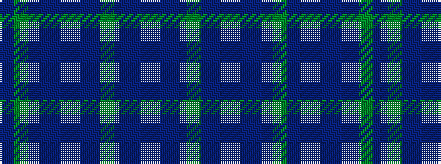

BGBBBBBGBBBBBG

It is a 14 stripe tartan.

<figure class="pat-woven">

<figcaption>idealised sample</figcaption>
</figure>

## Colour Sequence



## Tartans with this colour sequence

| Tartans |
|---------------|
| [Tiger of Sweden](/variants/s14/dg3dt1db2n2db16dt1dg1dt4db2n16db2dt1dg1db3~x2/)|
||
