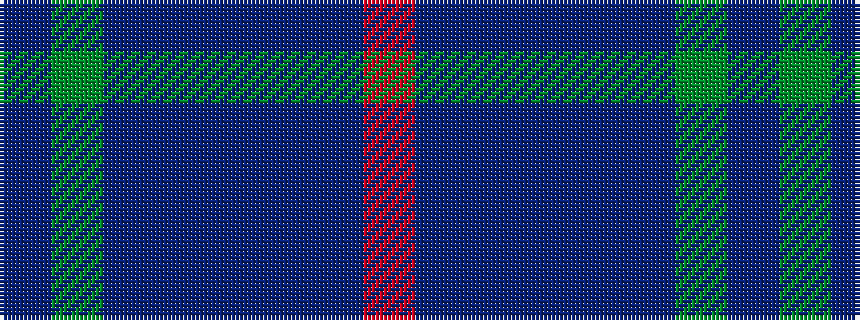

BGBBBBBR

It is a 8 stripe tartan.

<figure class="pat-woven">

<figcaption>idealised sample</figcaption>
</figure>

## Colour Sequence



## Tartans with this colour sequence

| Tartans |
|---------------|
| [Brigid Mhairi](/variants/s8/db2dg4n11dp19db1dp19dpi4o2~x2/)|
||
