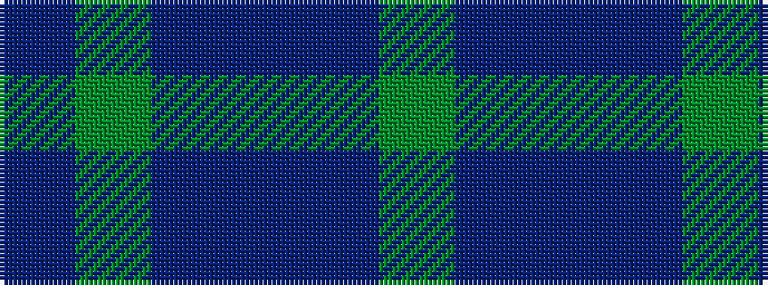

BGBBBG

It is a 6 stripe tartan.

<figure class="pat-woven">

<figcaption>idealised sample</figcaption>
</figure>

## Colour Sequence



## Tartans with this colour sequence

| Tartans |
|---------------|
| [Unidentified No 29](/setts/s6/dg3b6db11t2dg11db3~x2/)|
||
| [Unnamed, No 29](/setts/s6/db3g11t2db11b6g3~x2/)|
||
