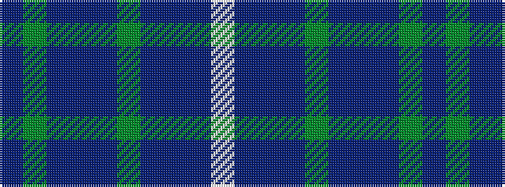

BGBBBGBBBW

It is a 10 stripe tartan.

<figure class="pat-woven">

<figcaption>idealised sample</figcaption>
</figure>

## Colour Sequence



## Tartans with this colour sequence

| Tartans |
|---------------|
| [Strathisla District Tartan](/variants/s10/db3dg8dt12dr3dp20dg3dt20db3dt20lb2~x2/)|
||
