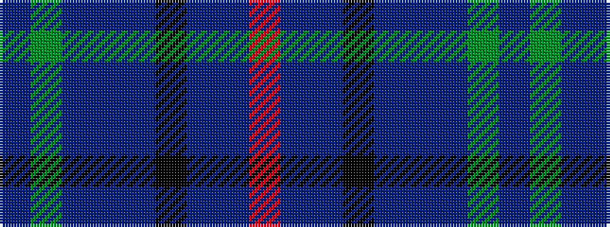

BGBBBKBBR

It is a 9 stripe tartan.

<figure class="pat-woven">

<figcaption>idealised sample</figcaption>
</figure>

## Colour Sequence



## Tartans with this colour sequence

| Tartans |
|---------------|
| [Robert Burns Legacy](/setts/s9/db10g42dbi8t8dbi8k24dbi8db71r10/)|
||
