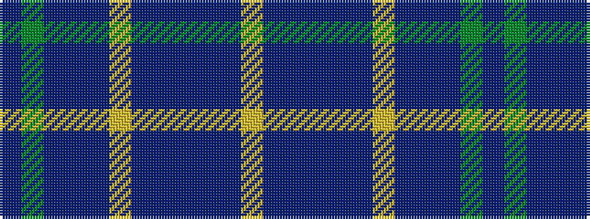

BGBBBYBBBBBY

It is a 12 stripe tartan.

<figure class="pat-woven">

<figcaption>idealised sample</figcaption>
</figure>

## Colour Sequence



## Tartans with this colour sequence

| Tartans |
|---------------|
| [Kerr of Ardgowan Clergy (Personal)](/setts/s12/ly2db1dp42t2dp6db1lo1db1dp4b4g1dp1~x2/)|
||
