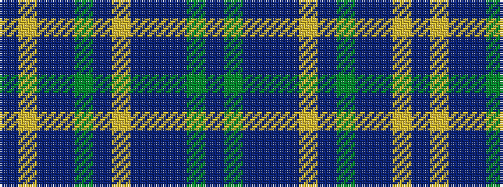

BGBBBYBGBBYB

It is a 12 stripe tartan.

<figure class="pat-woven">

<figcaption>idealised sample</figcaption>
</figure>

## Colour Sequence



## Tartans with this colour sequence

| Tartans |
|---------------|
| [Bowhunter](/variants/s12/n3dgi10n2dt25do3lr4do3dg10dt3n2lr3n1~x2/)|
||
