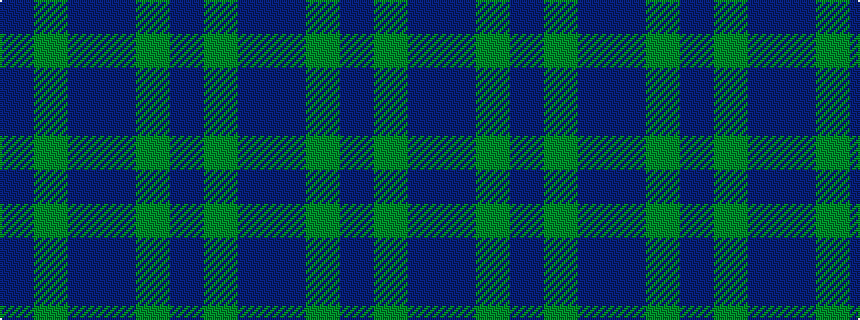

BGBBGB

It is a 6 stripe tartan.

<figure class="pat-woven">

<figcaption>idealised sample</figcaption>
</figure>

## Colour Sequence



## Tartans with this colour sequence

| Tartans |
|---------------|
| [Green Highland, The (Fashion)](/variants/s6/db2dg15do3db7dg7db2~x4/)|
||
