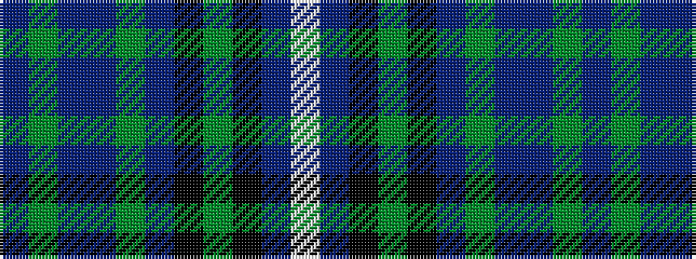

BGBBGBKGKBW

It is a 11 stripe tartan.

<figure class="pat-woven">

<figcaption>idealised sample</figcaption>
</figure>

## Colour Sequence



## Tartans with this colour sequence

| Tartans |
|---------------|
| [Highland Pride of Scotland (Fashion)](/setts/s11/db9dg2dp2dp2dg18dp2k2dg1k19db33w2~x2/)|
||
