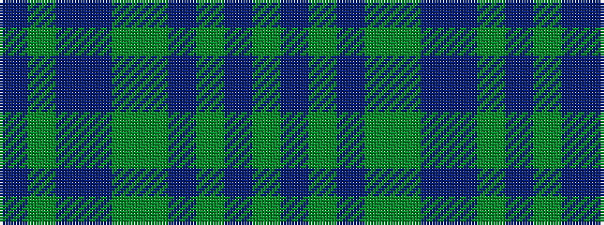

BGBBGGBGBG

It is a 10 stripe tartan.

<figure class="pat-woven">

<figcaption>idealised sample</figcaption>
</figure>

## Colour Sequence



## Tartans with this colour sequence

| Tartans |
|---------------|
| [Royal Scottish Agricultural Benevolent Institution](/setts/s10/y5do5y5do5y5g24do1db12g6do3~x2/)|
||
